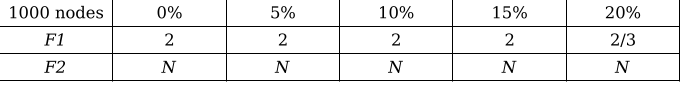
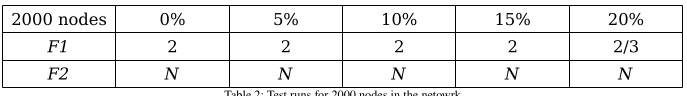

# Tapestry: A P2P Distributed Hash Table Network

#### Introduction
This is an implementation of the work done by Zaho et. al.[1] in creating a novel way to leverage Distributed Hash Tables. Tapestry provides a reliable way to communicate and share resources accross a P2P network. This project aims to implement that using Elixir as choice of programming language.
Please refer to doc/tapestry_jsac03.pdf for the original publication.

#### Highlights
The network can:
* publish/unpublish an object in network
* route to an object
* route to a node
* add new nodes to the network
* show fault tolerance when nodes fail abruptly

#### Methodology
The experiment was run with two topologies, with 1000 and 2000 nodes each,
failing 5%, 10%, 15% and 20% of nodes totaling to 8 experimental runs. Each run
has been tested 5 times to provide consistency in output. All these functions are the
part of DOLR API as specified in [1]

_Publish_ and _un-publish_ functions are best attempt functions and return no
confirmation. While _route to object_ function can either return the requested object
or fail. Note that route to object and add node functions have been exhibited in the
main part of this project.

#### Results
In our successive attempts to render the topology unusable, we have failed and thus
established its high degree of resilience.

The results are tabulated as following:




_F1_ represents the _route to object_ function call before _un-publish_ and _F2_
represents the contrast.

Note that, the tables tabulate the Hops required to fetch the object. Also,
value of “N” shows that the object was never found. An uncertain value is
represented as “_/_” which shows the integral bounds of uncertainty.

#### Execution
* The DOLR API as mentioned in the paper is located at Tapestry.Dolr module in src/tapestry/lib/dolr/dolr.ex
* To execute simple version:
```bash
cd src/tapestry
mix run tapestry.exs <num_of_nodes_in_network> <faliure_%age>
```
* This example version can run publish->route_to_obj->unpublish->route_to_obj cycles both before and after the predefined %age of nodes fail.

#### Reference
[1] [Tapestry paper](http://bnrg.cs.berkeley.edu/~adj/publications/paper-files/tapestry_jsac.pdf)
